 

## 🐺 About Me

Halo! Saya **MokioGeki-ID**, seorang **Junior Fullstack Developer** dari Indonesia. Saya membangun aplikasi web dari tampilan di browser sampai server dan database, dan senang mengerjakan sistem yang benar-benar dipakai orang, terutama untuk belajar dan pendidikan.

| Peran | Code yang dipakai | Dipakai untuk |
|:--|:--|:--|
| **Frontend** | JavaScript, React 18, Vite, HTML, CSS | Tampilan, routing halaman, animasi (Framer Motion) |
| **Backend** | JavaScript (Node.js + Express) | REST API, login JWT, OTP email, rate limiting, panel admin |
| **Database** | SQL (Supabase / PostgreSQL) | Tabel, relasi, Row Level Security |
| **Scripting** | Python | Latihan dan eksperimen kecil |

### 🛠️ Sistem yang sudah saya kerjakan

- **[B3Matika](https://github.com/MokioGeki-ID/Project_B3Matika)**: platform belajar matematika kelas 1 SD sampai 12 SMA/SMK. Isinya materi, latihan soal, game dan puzzle, papan skor, tutor AI (Gemini), serta panel admin. Dibangun dengan React, Express, dan Supabase.
- **[Profil PAUD TB Sawah Baru](https://github.com/MokioGeki-ID/Profil_Paud_TB_Sawah_Baru)**: website profil untuk PAUD, dibuat dengan JavaScript.
- **[SubnetKeep (Project TKJ)](https://github.com/MokioGeki-ID/SubnetKeep-Project-TKJ)**: proyek bertema TKJ (Teknik Komputer dan Jaringan) berbasis HTML.

### 🌱 Sedang saya perdalam

JWT, bcrypt, Row Level Security, dan SQL, supaya setiap fitur yang saya bangun bisa saya jelaskan dan perbaiki sendiri.

### 💬 Ask me about

- ⚛️ React dan Vite
- 🟢 Membuat REST API dengan Node.js dan Express
- 🗄️ Supabase dan PostgreSQL
- 🔀 Git dan GitHub
- 🎓 Membangun website untuk belajar dan sekolah

 

## ⚡ Tech Stack & Tools

| Kategori | Teknologi |
|:--|:--|
| **Languages** |  |
| **Frontend** |  |
| **Backend** |  |
| **Database** |  |
| **Tools** |  |

 

 

## 📊 GitHub Status

 

## 📁 Repositories

 

## 🌕 Contributions in the Last Year

 

## 🐾 Contribution Activity

 

